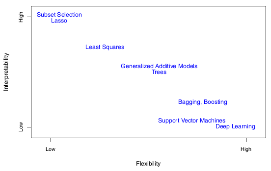
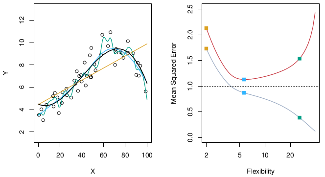
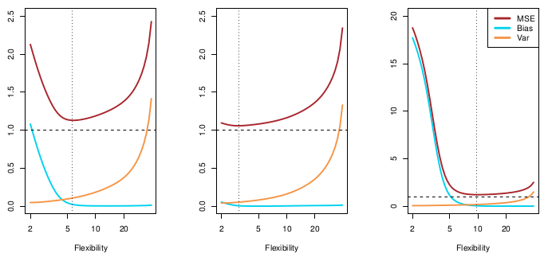
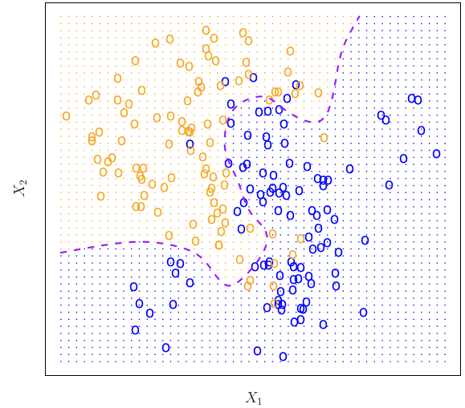
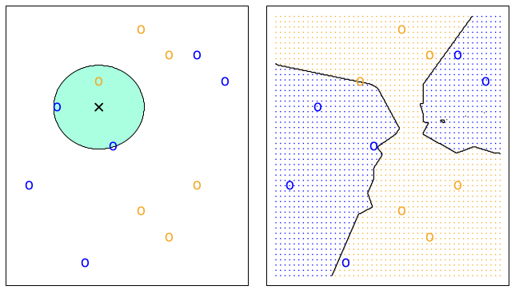
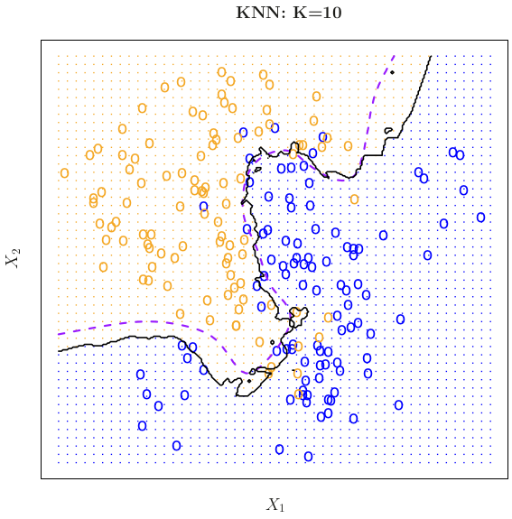
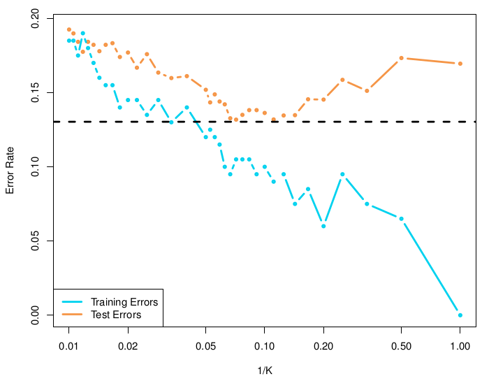

```{r setup, include=FALSE}
knitr::opts_chunk$set(echo = TRUE)
```

## Introduction

In this chapter we through overarching statistical concepts that are relevant for all the models in the coming chapters. I will be write simple notes and solving exercises when it makes sense for me.

## Notation

Here we go over how we will be referring to different concepts in the coming chapters e.g. input variables are referred to as *predictors*, *independent variables*, *features* and *variables*, whereas output variable are referred to as *response* or the *dependent variable*.
  
Y: Outputs  
X: Inputs  
n: The number of distinct data points  
p: The number of variables
$\\x_{ij}$: Sample by variable in a matrix  

We assume there is a relationship between X and Y, and that it can be written in the general form:
  
$Y = f(X) + \epsilon$
  
*f* is some unknown function and $\epsilon$ is the error term.

## Reducible and Irreducible Errors
The accuracy of a prediction depends on two quantities, which are referred to as the *reducible error* and the *irreducible error*. The *reducible error* is called so as it can be reduced by choosing a better model, while the *irreducible* error cannot be reduced as it cannot be predicted by X.

## Inference
**Inference** refers to the process of drawing conclusions about a population based on the analysis of a sample from that population. 

Inference includes:

* Identifying which predictors are associated with the response
* Identifying the relationship between the response and each predictor
* Identifying if the model can adequately capture the relationship between X and Y

Often *inference* and *prediction accuracy* conflict as simple models are more interpretable, while complex models fit the data better and thus allow for more precise predictions.

## Parametric vs Non-Parametric Methods

* Parametric
  * We reduce the problem of estimating *f* down to estimating a set of parameters, and assumes a probability distribution for the data.
  * Examples: Linear regression, logistic regression
  * Steps:
    1. We choose a model
    2. We use training data to *fit* or *train* the model e.g. using *least squares*
  * Disadvantage: It can be hard to choose the right model and one often underfits the data
* Non-Parametric
  * We do not make explicit assumptions about the functional form of *f*, or about the distribution of the data.
  * Example: KNN, Decision Trees
    * For KNN we use samples that are near by in vector space to make inferences about unknown data points
    * For Decision Trees we create a flowchart-like structure where eace note represents a feature and each branch a decision rule.
  * Disadvantages: Often requires a large number of observations and often overfits

## Trade-Off between Prediction Accuracy and Model Interpretability
In the figure is shown the different models that are covered in the book and how flexible and how interpretable they are. We can see that the more flexible a model is the harder it is to interpret.

<center>
{width=80%}
</center>

When inference is the goal, there are clear advantages to using simple and relatively inflexible statistical learning methods. In some settings, however, we are only interested in prediction, and the interpretability of the predictive model is simply not of interest.

## Supervised vs Unsupervised Learning

* Supervised Machine Learning:
  * In supervised learning, the training data consists of input features and corresponding labeled outputs.The goal is to learn a mapping function from input to output by using the labeled data.
  * Examples of supervised learning methods include:
    * Linear regression
    * Logistic regression
    * Decision trees
    * Support vector machines
    * Neural networks
* Unsupervised Machine Learning:
  * In unsupervised learning, the training data does not have labeled outputs, and the algorithm explores the patterns and structures within the data on its own. The goal is to discover inherent structures, relationships, or clusters in the data.
  * Examples of unsupervised learning methods include:
    * K-means clustering
    * Hierarchical clustering
    * Dimensionality reduction techniques like Principal Component Analysis (PCA) and t-SNE

## Regression vs Classification
Variables can be characterized as either quantitative (numerical values) or qualitative (categorical values). We refer to problems with a quantitative response as regression problems, while those involving a qualitative response are referred to as classification problems. The characterization is, however, not clear cut as e.g. logistic regression is often used for classification where the probabilities the model outputs are translated into categories.

## Assessing Model Accuracy (Regression)
A models accuracy should always be assessed on a previously unseen test data set, as it may overfit the data it was trained on! To the left in the figure is show some simulated data (black) and three fitted models: Linear (orange), spline 1 (blue), spline 2 (green). To the right the MSE is show of the training data (grey) and on the test data (red). While the most flexible model (spline 2) fits the training data the best, we can see it fits the test data poorly. When a given method yields a small training MSE but a large test MSE, we are said to be *overfitting* the data.

<center>
{width=80%}
</center>

There is no measure of accuracy that fits all problems, but the most commonly used measure for regression is Mean Squared Error (MSE).

* Mean Squared Error
  * The average squared distance between the real values and the predicted values.
  
## The Bias-Variance Trade-Off
The expected average *test MSE* for a value of x0, if we trained a bunch of models, can be calculated as the variance of the predictions plus the squared bias of the predictions plus the variance of the $\epsilon$. That is:

1. We train a bunch of models on different training sets
2. For a sample from the test data we:
    1. Make predictions with all of the models
    2. We calculate the *Mean Squared Error* of the predictions  
        a. Calculate the squared error for each prediction
        b. Calculate the mean
    3. We calculate the *Variance* of the predictions
        a. Calculate the mean prediction
        b. Subtract the mean from each prediction
        c. Square the differences
        d. Calculate the mean
    4. We calculate the *Bias* of the predictions
        a) Calculate the error for each prediction
        b) Add up the differences
        c) Divide the sum of the differences by the total number of inputs  
When we talk about the variance-bias trade-off we refer to variance and bias in the following ways:

* Variance
  * The amount by which the model would change if we estimated it using a different training data set
  * If a method has a high variance then small changes in the training data can result in large changes in the model's parameters.
* Bias
  * The error that is introduced by a choosing a model that cannot capture the relationships in the data e.g. using a linear model to capture non-linear relationships.
  * A model has a high bias if it cannot produce accurate estimates of the data.

For a *flexible* model you would expect:

* A low average bias on the test data because the bias of the individual predictions would be distributed around zero
* A high average variance on the test data because the predictions would be all over the place.

For an *inflexible* model you would expect:

* A high average bias as the model would likely make systematic errors in one direction
* A low average variance as the model would make similar predictions across models.

A summary of the variance-bias tradeoff can be seen in the figure from left to right for three datasets: 1. Simple non-linear relationship, 2. linear relationship, 3. Complicated non-linear relationship. The MSEs in the plots are for the test data.

<center>
{width=80%}
</center>

The reason it is referred to as a trade-off is because it is easy to obtain a method with extremely low bias but high variance (for instance, by drawing a curve that passes through every single training observation), or a method with low variance and high bias (for instance a model that always predicts the value 1). The challenge is to find a model that both fits the data well, but that also preforms well on unseen data.

## Assessing Model Accuracy (Classification)
The most common approach for quantifying the accuracy of classification models is using the *error rate*, which is simply the proportion of mistakes.

If you already know the model that produces the data (which you don't!), the most accurate way to minimize the *error rate* in (a binary setting) is to use *Bayes Classifier*, which assigns samples to class A if the probability is >0.5, and else assigns them to class B. If we calculate probabilities for all combinations of predictors, we will furthermore find samples where the probability of A and B are equal, and combinedly these are called the *Bayes decision boundary* (see figure).

<center>
{width=50%}
</center>
In the real world we attempt to estimate the model, and one way is using the K-Nearest Neighbor model, which simply finds the K nearest neighbors of your sample, and averages their lables. 

The KNN approach is shown in the figure for K=3.
<center>
{width=50%}
</center>
How close KNN with K=10 is shown in the figure. It gets pretty close to the perfect *Bayes Classifier*!
<center>
{width=50%} 
</center>
When using KNN the choice of K has a drastic effect on the KNN classifier that can become too flexible with a low K, and become to unflexible with a high K. E.g. with K=1 the training error would be zero, which the test error would probably be quite high (see figure).
<center>
{width=50%}
</center>
# Chapter Exercises & Answers
As most exercises are redundant for my brush up on statistical methods, I will only be solving select exercises. Great answers by Liam Morgan to all of the exercises can be found at [RPubs](https://rpubs.com/lmorgan95/ISLR_CH2_Solutions).

## College Data
In this exercise we run through the **College** data set, and play a bit around with the data. For this purpose I will be using **ggplot2** rather than the native R package.

```{r, warning=FALSE, message=FALSE}
# Loading libraries
library(ISLR)
library(tidyverse)

# Loading data
college <- ISLR::College
```

We start out by looking at the different variables and plotting them against each other.

```{r}
# Getting an overview of the variables
summary(college[,1:5])
```
Plotting some of the variables against each other.

```{r}
# Plotting first five variables against each other
pairs(college[,1:5])
```
We add a variable to indicate whether the university is elite or not. We call a university elite if more than 50 % of the university's students come from the top 10 % of their high schools.

```{r}
# Adding elite column
college$Elite <- factor(ifelse(college$Top10perc > 50, 'Yes', 'No'))
```

We now explore whether there is a correlation between tuition and elite-status in box plots.

```{r}
# Comparing Elite to Outstate
ggplot(college, aes(Elite, Outstate)) + 
  geom_boxplot()
```