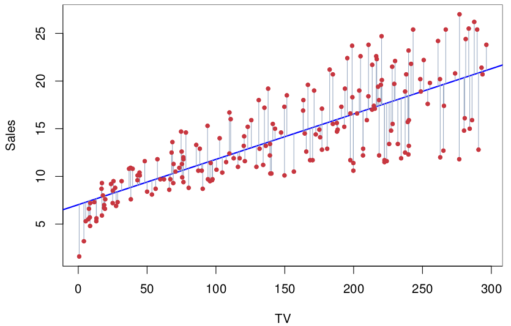
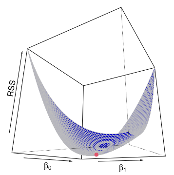
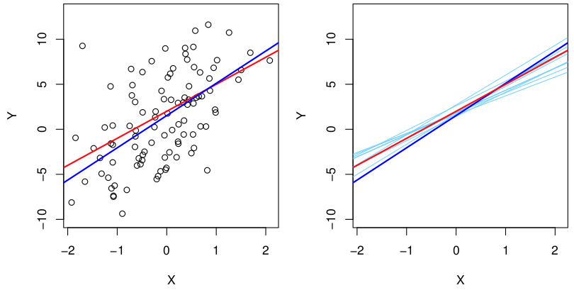
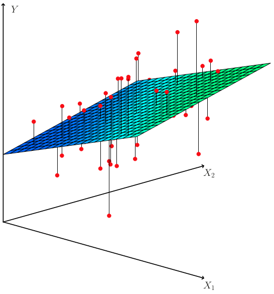
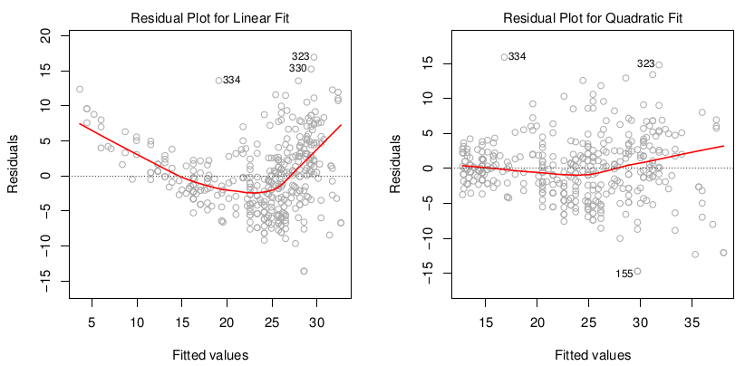
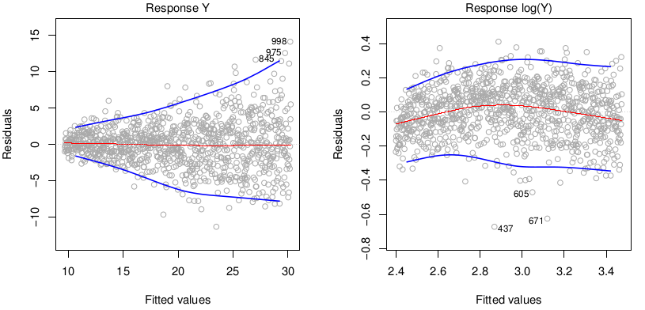

```{r setup, include=FALSE}
knitr::opts_chunk$set(echo = TRUE)
```

# Introduction

In this chapter we focus on *linear regressions*, how they work and what kind of problems they can solve.

All the same things can also be learned by following the following [Statquest playlist](https://www.youtube.com/watch?v=PaFPbb66DxQ&list=PLblh5JKOoLUIzaEkCLIUxQFjPIlapw8nU&index=1).

# What Questions can we Answer with Linar Regressions?

Suppose we have a data set with sales as well as budgets for various types of advertisement, what kind of questions would we be able to answer:

* Is there a relationship between advertising budget and sales?
* How strong is the relationship between advertising budget and sales?
* Which media are associated with sales?
* How large is the association between each medium and sales?
* How accurately can we predict future sales?
* Is the relationship linear?
* Is there synergy among the advertising media?

# 1. Simple Linear Regression

Mathematically we can write a *simple linear regression* as:

$Y = \beta_0 + \beta_1X$ 

This could e.g. be a relationship between a TV-advertisement budget and sales, where $\beta_0$ and $\beta_1$ are two unknown *coefficients* that represent the *intercept* with the y-axis and the *slope* of the line.

$Sales = \beta_0 + \beta_1*TV$ 

## 1.1 Estimating the Coefficients

Our aim is to fit a linear line through the data that minimizes the distances between the predicted values and the actual values. To estimate the *coefficients* for such a line we use data. 

The distances between a predicted values and an actual value is called a *residual*, and *residuals* for all the data points can be seen in **Figure 1** as grey lines.

A residual is calculated as the difference between the actual value and the predicted value in the following way:

$e = y_i-\hat{y}_i$

<center>
{width=80%}
</center>

Despite the aim of minimizing the absolute distances between the predicted and the actual values in practice we instead minimizes the *Residual Sum of Squares (RSS)*, as it is more mathematical well-behaved than absolute values.  

The *residual sum of squares (RSS)* is calculated as:

$RSS = e_1^2 + e_2^2 + .... + e_n^2 <=>$  
$RSS = (y_1 + \beta_0 - \beta_1x_1)^2 + (y_2 + \beta_0 - \beta_1x_2)^2 .... + (y_n + \beta_0 - \beta_1x_n)^2$

The two *coefficients*, $\beta_0$ and $\beta_1$, can be minimized with the following equations:

$\beta_1=\frac{\sum_{i=1}^n(x_i-\overline{x})(y_i-\overline{y})}{\sum_{i=1}^n(x_i-\overline{x})}$  
$\beta_0=\overline{y}-\beta_1\overline{x}$

In **Figure 2** you can see the calculated RSS for different $\beta_0$ and $\beta_1$ values used on the advertisement dataset. The red dot marks the minimum RSS. The minimum can be found by differentiating the RSS model, and finding finding where it is equal to zero.

<center>
{width=40%}
</center>

## 1.2 Assessing the Accuracy of the Coefficient Estimates

We have a true model:

$Y = 2 + 3X + \epsilon$

We create 100 random *Xs* and calculate *Ys* where we add some random noise, $\epsilon$. In **Figure 3** these noisy points are shown, the true *population regression line* is shown in red and the *least squares line* calculated on the noisy sample is shown in blue. 

To the right in **Figure 3** we have made noisy samples ten times and calculated their regression lines (light blue).

{width=70%}

In general the *sample coefficients* are good estimates of the *population coefficients*, and on average ($\mu$) we expect them to be equal to the *population coefficients*. However, in a real world scenario we only have one sample, and we do not know if it is an over- or under-estimate of the *population coefficients*. 

In general our confidence in the *sample coefficients* are estimated by computing the *standard error*. The *standard error* can be calculated via a formula (see below) or via *bootstrapping*. I prefer bootstrapping as it is a more transparent solution, as you sample your sample, and identify the deviation in the sample mean (standard error).

$Var(\hat{\mu}) = SE(\hat{\mu})^2 = \frac{\sigma^2}{n}$

The [*standard error*](https://www.youtube.com/watch?v=A82brFpdr9g) roughly tells us the average amount that the estimated sample $\hat{\mu}$ differs from the actual value of $\mu$. It is calculated in the following way:

1. Collect a sample of data from the population you're interested in studying.
2. Calculate the mean of your sample
3. Calculate the difference between each observation in your sample and the sample mean $(x-\overline{x})$
4. Square each of the differences obtained in Step 3. 
5. Sum up all the squared deviations obtained in Step 4.
6. Divide the sum of squared deviations from Step 5 by the sample size (n), which gives us the variance (the average squared deviation).
7. Calculate the standard error (SE) by taking the square root of the variance (s^2) and dividing it by the square root of the sample size (n).

The more observations we have the smaller the standard error of $\hat{\mu}$.

The Standard errors can be used to compute *confidence intervals*. A *95 % confidence interval* e.g. is a range of values such that with 95 % probability the range will contain the true value. 

For linear regression the 95 % confidence interval for $\beta_1$ can be approximated using:

$\hat{\beta_1} \pm 2*SE(\hat{\beta_1})$

*t-statistics* is the number of standard deviations a value is away from zero.

$t = \frac{\hat{\beta_1-0}}{SE(\hat{\beta_1)}}$

## 1.3 Assessing the Accuracy of the Model

We want to quantify *the extent to which the model fits the data*. This is usually assessed using the two quantities:

* $R^2$ Statistics
* Residual standard error (RSE)

### 1.3.1 $R^2$

$R^2$ is a measure of the *proportion of variance explained*. It is calculated in three steps: 

1. Run a line through the mean, and calculate the *total sum of squares (TSS)*: $TSS=\sum{(y_i-\overline{y})^2}$. 
2. Calculate the *residual sum of squares (RSS)* for your model: $RSS=\sum{(y_i-\hat{y}_i)^2}$. 
3. Now we can calculate the proportion of the *variance that is explained by the model*: $R^2=\frac{TSS-RSS}{TSS}$.
  * Note that sometimes the formula includes all values divided by *n* as TSS/n is the *variance*, but during division *n* disappears, which is why we don't include it in the calculation here.  

If a model fits the data perfectly the $R^2$ is 1. It should be noted that as more parameters are added to a model the closer $R^2$ will get to 1.

If a model is only built from two values $R^2$ will always be equal to one. So $R^2$ is not perfect, and we need a *p-value* to assess our confidence in $R^2$, which is done using the *F-statistic*. *F* is calculated in the following way:

$F = \frac{Variation\ in\ Y\ explained\ by\ X_1}{Variation\ in\ Y\ not\ explained\ by\ X_1} <=>$
$F = \frac{TSS-RSS/(p_{fit}-p_{mean})}{RSS(n-p_{fit})}$

Here $p_{fit}$ is the number of parameters in the model (y-intercept + slope), $p_{mean}$ is the number of parameters in the mean line (y-intercepts) and *n* is the number of samples.

To estimate the *p-value* we calculate *F* for a bunch of random data sets (with similar variance and range), and get a *F-distribution*. Now we can calculate how many percent of the values in the *F-distribution* are equal or higher than the *F-value* we calculated for our model. This percentage is the *p-value*.

### 1.3.2 Residual Squared Error

The RSE is the average amount that the response will deviate from the true regression line. The formula uses a *magic number*, 2, to account for the error in small data sets.

$RSE = \sqrt{\frac{1}{n-2}RSS}$

We can calculate the percentage error by comparing the error if we had just predicted the mean value of *y* for all data points to the RSE. The *RSE/MeanError* tells us the percentage error.

# 2. Multiple Linear Regression

I practice we have more than one predictor, thus here we extend the *simple regression* to multiple variables. 

$Y = \beta_0 + \beta_1X_1 + \beta_2X_2 + ...+\beta_pX_p+\epsilon$

In such a model we interpret $\beta_j$ as the average effect on Y of a one unit increase of $X_j$ if all other predictors are fixed.

## 2.1 Estimating the Regression Coefficients

As with the simple linear regression we again want to minimize the RSS. See **Figure 4**.

<center>
{width=40%}
</center>

The coefficients for a Multiple Linear Regression can be interpreted in the following way. For a given amount of $X_1$ and $X_2$ the spending an additional unit of $X_3$ is associated with $\beta_3$ units of $Y$.

If one had made three simple regressions and a single multiple regression model, the coefficients of the different $X_j$ wouldn't necessarily be the same. This is because in the *multiple regression setting* the coefficient for one predictor represents the average increase in sales if the other predictors are held constant. This means that the effects of correlated predictors will be evened out, e.g. in a *simple regression* ice-cream sales would be associated with shark attacks, while in *multiple regression* where we add a predictor stating how many people are in the water, the effect of ice-cream sales on shark attacks will likely dissapear.

## 2.2 Is at least one of the predictors $X_1, X_2,...,X_p$ useful in predicting the response?

We have to test if all the regression coefficients are zero.

$H_0 : \beta_1 = \beta_2 = ... = \beta_p = 0$

Versus the alternative 

$H_a : at\ least\ one\ \beta_j\ is\ non-zero$

This hypothesis test is performed by computing the *F-statistics*.

$F = \frac{(TSS-RSS)/p}{RSS/(n-p-1)}$

If there is no relationship, you would expect F to take on a value close to 1. If there is a relationship you would expect $E\{(TSS-RSS)/p\}>\sigma^2$. How large the F-statistic needs to be depends on the values of *n* and *p*. The significance (p-value) of the F-statistic is usually looked up for different *n* and *p* in a look-up table, which has values for the different F-distributions.

If we want to test the hypothesis that a subset of the coefficients are zero, we just fit another model that only uses that subset of variables. 

The t-statistic and p-values for each model reports the *partial effect* of adding that variable to the model. That is, models are created with and without the variables, and their F-statistics are calculated in the following way:

$F = \frac{(RSS_o-RSS)/q}{RSS/(n-p-1)}$

Here $RSS_0$ is the value for the model without the variable, and *q* is the number of variables (1).

## 2.3 Do all the predictors help explain Y?

When computing the F-statistic p-value we determine if *at least one variable* is associated with the outcome, but now it is time to find which ones.

One could simply look at their p-values, but if p is large, one is likely to make false discoveries. What one instead should do is *variable selection*. One could try out all possible models and then judge their quality using one of the following: *Mallow’s $C_p$* , *Akaike information criterion (AIC)*, *Bayesian information criterion (BIC)*, and *Adjusted $R^2$*.

It is, however, usually practically impossible to make all $2^p$ models, so instead usually does one of the following things:

* Forward Selection
  1. Start with a *null model*
  2. Fit one model with each predictor, and add the predictor with the lowest RSS
  3. Repeat 2. until some stopping rule
* Backward Selection
  1. Start with all variables
  2. Remove the variable with the largest p-value
  3. Fit a new model
  4. Repeat 2. and 3. until a stopping rule is fulfilled
* Mixed Selection
  1. Start with a *null model*
  2. Fit one model with each predictor, and add the predictor with the lowest RSS
  3. Remove a variable if its p-value has gone over the level of significance.
  4. Repeat 2. and 3. until some stopping rule

## 2.4 How well does the model fit the data?

As with a *simple linear model* we again use RSE and $R^2$. One should, however, be aware that as the number of predictors increases the $R^2$ always increases! That is why one should look at the adjusted $R^2$ as it takes the extra parameters into account.

## 2.5 Given a set of predictor values, what response value should we predict, and how accurate is our prediction?

Inaccuracies in the coefficient estimates can be computed using a *confidence interval*
Inaccuracies in the Y estimates can be computed using a *prediction interval*.

# 3. Interactions
Linear models make several highly restrictive assumptions that are often violated in practice. Two of the most important assumptions state that the relationship between the predictors and response are additive and linear. Here we remove the *additive* assumption by adding an *interaction* term to the model.

$Y = \beta_0 + \beta_1X_1 + \beta_2X_2 + \beta_3X_1X_2 + \epsilon <=>$
$Y = \beta_0 + (\beta_1 + \beta_3X_2)X_1 + \beta_2X_2 + \epsilon$

This can be interpreted as if adding one unit of $X_1$ then $Y$ will increase by $\beta_1 + \beta_3X_2$ units. 

NOTE: The hierarchical principle states that if we include an interaction in a model, we hierarchical should also include the main effects, even if the p-values associated with principle their coefficients are not significant.

4. Non-Linear Relationships
Here we present a very simple way to directly extend the linear model
to accommodate non-linear relationships, using *polynomial regression*. NOTE: It is still a *linear model*!

$Y = \beta_0 + \beta_1X_1 + \beta_2X_1^2 + \epsilon$

5. Common Problems with Linear Models
Here we go over the most common problems when fitting linear models to data:

5.1 Non-Linearity of the Data
If plotting the residuals against the fitted/predicted values it is possible pick up non-linearities as show in the figure. You would expect the errors to be equally distributed around zero for all Y-values if the model fits the data well.

<center>
{width=80%}
</center>

Ways to adress the issue is to make non-linear transformations to the data (log X, $\sqrt{X}$, $X^2$).

5.2 Correlation of Error Terms
An important assumption of the linear regression model is that the error
terms, $\epsilon_1$, $\epsilon_2$ , . . . , $\epsilon_n$, are uncorrelated. If they are correlated: 

* The estimated *standard errors* of the *regression coefficients* will be underestimated.
* Confidence and prediction intervals will be too narrow
* p-values will be too low

The problem is best understood with the example where we accidentally double our data, which would result in a narrowing our our confidence interval by a factor of $\sqrt{2}$. The problem is most often seen in time series where observations that are obtained at adjacent time points will have positively correlated errors. The problem can be identified by plotting the residuals as a function of time, and be seen if adjacent data points have similar residuals (this is called *tracking*).

This problem can mainly be mitigated by making a good *experimental design*.

5.3 Non-constant Variance of Error Terms
Another important assumption of the linear regression model is that the
error terms have a constant variance, $Var(\epsilon_i)=\sigma^2$. The standard errors, confidence intervals, and hypothesis tests associated with the linear model rely upon this assumption.

The most common case of this is seen where the variance of the error terms increase as the value increases, this is also called *heteroscedasticity*. A example can be seen in the figure.

<center>
{width=80%}
</center>

One of the most usual ways to fix this problem is to $logY$ or $\sqrt{Y}$. Another way is to use *weighted least squares*.

5.4 Outliers
An *outlier* is a point for which $y_i$ is far from the $y$ predicted by the model. 

##### CONTINUE HERE #####


# X. Chapter Exercises & Answers
As most exercises are redundant for my brush up on statistical methods, I will only be solving select exercises. Great answers by Liam Morgan to all of the exercises can be found at [RPubs](https://rpubs.com/lmorgan95/ISLR_CH3_Solutions).

## 3.1 Simple Linear Models

Here we will just build a simple linear model and examine its different statistics. First we create some data.

```{r, message=FALSE, warning=FALSE, fig.width = 5, fig.asp = .62,  fig.align = "center"}
# Libraries
library(tidyverse)

# Creating some data
mouse.data <- data.frame(
  weight = c(0.9, 1.8, 2.4, 3.5, 3.9, 4.4, 5.1, 5.6, 6.3),
  size = c(1.4, 2.6, 1.0, 3.7, 5.5, 3.2, 3.0, 4.9, 6.3)
)

# Plotting data
ggplot(mouse.data, aes(weight, size)) +
  geom_point() +
  theme_bw()
```

We create a simple linear model.

```{r, message=FALSE, warning=FALSE}
# Fitting a linear model
mouse.regression <- lm(size ~ weight, data=mouse.data)

# Summarizing model
summary(mouse.regression)
```
Here we go over the summary of the model:

* Call: It is just the model call
* Residuals: The distribution of the residuals
  * You would like the distribution to be symmetric around zero
* Coefficients:
  * Intercept: The estimated intercept with the y-axis
    * Standard Error and t-values are used to calculate the p-value
    * p-value is an estimate of whether the value is zero or not
  * Weight: The estimated slope of the linear line
    * Standard Error and t-values are used to calculate the p-value
    * p-value is an estimate of whether the value is zero or not
* Residual Standard Error: Square root of the denominator for *F*
* Multiple R-squared: R-squared as described earlier
* Adjusted R-squared: R-squared scaled by the number of parameters
* F-statistic: Tells is if R-squared is significant or not

Finally we add the regression line to our plot

```{r, message=FALSE, warning=FALSE, fig.width = 5, fig.asp = .62,  fig.align = "center"}
# Plotting regression line
ggplot(mouse.data, aes(weight, size)) +
  geom_point() +
  geom_smooth(method = "lm",se = F) +
  theme_bw()
```

## 3.1 Multiple Regression

Here we build a multiple regression model and examine its different statistics. First we create some data.

```{r}
# Creating some data
mouse.data <- data.frame(
  weight = c(0.9, 1.8, 2.4, 3.5, 3.9, 4.4, 5.1, 5.6, 6.3),
  size = c(1.4, 2.6, 1.0, 3.7, 5.5, 3.2, 3.0, 4.9, 6.3),
  tail = c(0.7, 1.3, 0.7, 2.0, 3.6, 3.0, 2.9, 3.9, 4.0)
)

# Plotting the data
plot(mouse.data)
```
In the plots we can see that both weight and tail are correlated with size, which is what we want, but we also see that they are correlated with each other. This may mean that a model with either tail or weight will be sufficient.

We create a multiple regression model.

```{r}
# Fitting a plane to the data
mouse.regression <- lm(size ~ weight + tail, data=mouse.data)

# Summarizing model
summary(mouse.regression)
```
As we are running multiple regression we are more interested in the *Adjusted $R^2$*, as it takes the extra parameter into account. We can see that the *p-value* for the weight is no longer significant. 

When looking at the statistics for the coefficients they are based on a comparison between a model with the variable and without it. The p-value of 0.4345 means that a model that uses the weight and tail variables is not significantly better than one using just the tail variable.


