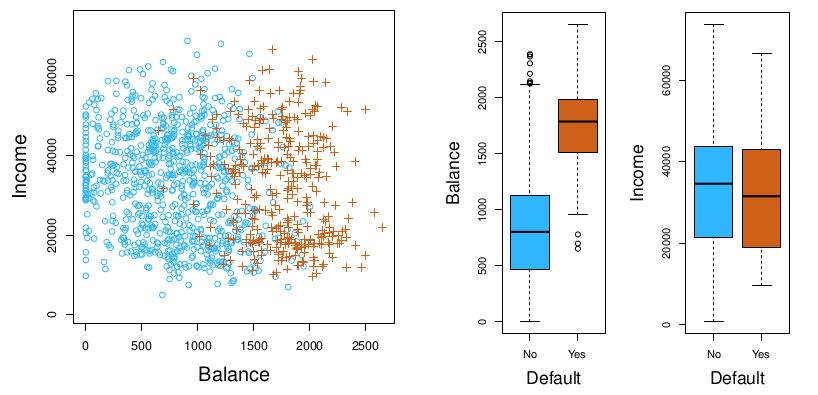
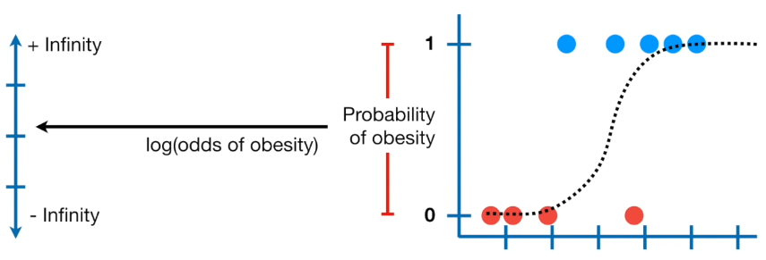

```{r setup, include=FALSE}
knitr::opts_chunk$set(echo = TRUE)
```

# Introduction

In this chapter we focus on *classfication*. This includes *logistic regression*, *linear discriminant analysis*, *quadratic discriminant analysis*, *naive Bayes* and *K-nearest neighbors*.

All the same things can also be learned by following the following [Statquest playlist](https://www.youtube.com/watch?v=yIYKR4sgzI8&list=PLblh5JKOoLUKxzEP5HA2d-Li7IJkHfXSe).

# Data
In this chapter we will try to predict if a person will default or not based on income and account balance (see figure).

<center>
{width=80%}
</center>

# Why not Linear Regression?
Unfortunately the coding of output variable would imply an ordering on the outcomes, which would mess up the model. Even for two classes a model would not output probabilities, but it would also output values outside the interval [0:1].

# 1. Logistic Regression
Instead of fitting a line to the data, a *logistic regression* fits an S-shaped logistic function with the max and minimum values 1 and 0. Despite the function having a different shape, *logistic regression* is still considered a linear model. A *logistic regression*, for a binary outcome, calculates the probability for one of the outcomes $p(default)$, and has the formula:

$p(X) = \frac{e^{\beta_0+\beta_1X}}{1+e^{\beta_0+\beta_1X}}$

This model is fit using *maximum likelihood*, which is basically fitting a bunch of S-shaped lines and calculating their probabilities given the data. The line with *maximum likelihood* is then picked.

In logistic regression the y-axis is transformed from *probability* to *log(odds)*, such that its y-axis can go from -infinity to +infinity, just like that of linear regression.

<center>
{width=90%}
</center>

The translation between *probability* and *log odds* can see for a sample in the table inderneath.

```{r, warning=F, message=FALSE, echo=FALSE}
# Log Odds translations
translation_table = data.frame(
  "Propability" = seq(0.1, 0.9, 0.1), 
  "Odds" = seq(1,9)/seq(9,1),
  "Log Odds" = log(seq(1,9)/seq(9,1)))
knitr::kable(translation_table, "pipe")
```

# 1.1 Coefficients

The coefficients you get when doing logistic regression are for a linear line in a coordinate system where the y-axis is measured in *log(odds)*. You get the following statistics:

Intercept: Self-explanatory
Slope: Self-explanatory
Standard Error: How much one expects the value to vary from the real value
Z-value: The estimated coefficient divided by the standard error, thus the number of standard deviations the coefficient is away from zero.


https://www.youtube.com/watch?v=vN5cNN2-HWE&list=PLblh5JKOoLUKxzEP5HA2d-Li7IJkHfXSe&index=2
9:25


Unlike linear regression, we can't easily compare the complicated model to the simple model e.g.: 

**Obesity** predicted by **Weight + Genotype**  
vs  
**Obesity** predicted by **Weight + Genotype + Age**  


STATQUEST: https://www.youtube.com/watch?v=yIYKR4sgzI8&list=PLblh5JKOoLUKxzEP5HA2d-Li7IJkHfXSe


# X. Chapter Exercises & Answers
As most exercises are redundant for my brush up on statistical methods, I will only be solving select exercises. Great answers by Liam Morgan to all of the exercises can be found at [RPubs](https://rpubs.com/lmorgan95/ISLR_CH4_Solutions).

# X.1 Logistic Regression

Here we download the **Heart Disease Dataset** to classify if a person is healthy or unhealthy.

```{r, warning=FALSE, message=FALSE}
# Libraries
library(tidyverse)
library(cowplot)

# Downloading data
url <- "http://archive.ics.uci.edu/ml/machine-learning-databases/heart-disease/processed.cleveland.data"
data <- read.csv(url, header=FALSE)

# Adding column names
colnames(data) <- c("age", "sex", "cp", "trestbps", "chol", "fbs", "restcg", "thalach", "exang", "oldpeak", "slope", "ca", "thal", "hd") 

# Fixing column types
data[data == "?"] <- NA
data$sex <- ifelse(data$sex == 0, "F", "M")
data$ca <- as.integer(data$ca)
data$thal <- as.integer(data$thal)
data$hd <- ifelse(data$hd == 0, "Healthy", "Unhealthy")
factor_columns <- c("sex","cp", "fbs", "restcg", "exang", "slope", "ca", "thal", "hd")
data[factor_columns] <- lapply(data[factor_columns], factor)

# Removing samples with missing data
data <- data[!(is.na(data$ca) | is.na(data$thal)),]
```

Now we will make increasingly more complex models predicting health

```{r}
# Making a logistic regression model
model <- glm(hd ~ sex, data=data, family = "binomial")
summary(model)
```

The output equations is:

$hearth\ disease=-1.0438+IsMale*1.2737$

The output value of the equation is the *log odds* that a person has a heart disease. Translation between probability, odds and log odds are best explained in this table.

```{r, warning=F, message=FALSE, echo=FALSE}
# Log Odds translations
translation_table = data.frame(
  "Propability" = seq(0.1, 0.9, 0.1), 
  "Odds" = seq(1,9)/seq(9,1),
  "Log Odds" = log(seq(1,9)/seq(9,1)))
knitr::kable(translation_table, "pipe")
```

So the results are interpreted as if your *log odds* for heart disease will increase by 1.2737 if you are a male. The *standard error* and *z-value* are for calculating the *Wald's test*, while the p-value states its significance. 

Now it is time for a mode fancy models with all the variables.

```{r}
# Making a logistic regression model
model <- glm(hd ~ ., data=data, family = "binomial")
summary(model)
```
```{r}
# Calculating McFadden's Pseudo R^2
ll.null <- model$null.deviance/-2
ll.proposed <- model$deviance/-2
(ll.null-ll.proposed)/ll.null

# Calculating p-value using a chi-squared distribution
1 - pchisq(2*(ll.proposed - ll.null), df=(length(model$coefficients)-1))
```
The $McFaddan\ Pseudo\ R^2$ can be interpreted as the overall effect size, and its p-value is significant as it if very close to zero. Now let's draw a graph with the predictions.

```{r, fig.width = 5, fig.asp = .62,  fig.align = "center"}
# Making predictions
predicted.data <- data.frame(
  probability.of.hd=model$fitted.values,
  hd=data$hd
)

# Ordering data
predicted.data <- predicted.data[order(predicted.data$probability.of.hd, decreasing = F),]

# Adding index
predicted.data$index <- seq(1, nrow(predicted.data))

# Plotting data
ggplot(predicted.data, aes(index, probability.of.hd, color=hd)) +
  geom_point() +
  ylab("Predicted probability of\ngetting heart disease") +
  labs(color='Heart Status') +
  theme_bw()
```


```{r, message=FALSE, warning=FALSE, fig.width = 5, fig.asp = .62,  fig.align = "center"}
# Libraries
library(tidyverse)
```


NEXT: "Odds and Log(Odds) clearly explained", "Odds Ratios and Log(Odds Ratios) clearly explained", "Saturated Models and Deviance Statistics"


